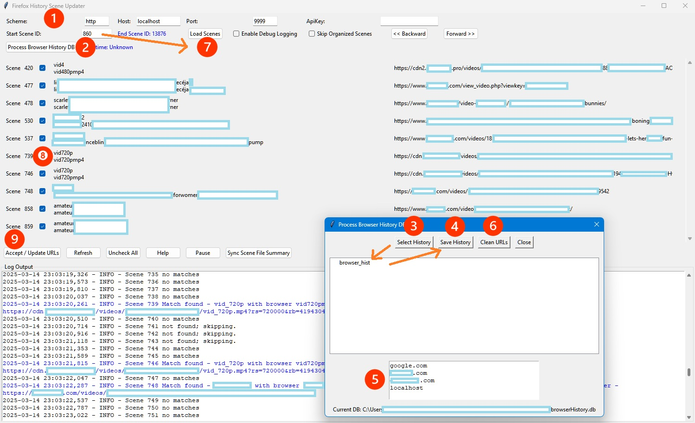

# urlstashgui
Use your browser history to find URL matches for scenes in StashApps

## Stuff you need
- StashApps
- Browser history  
  - e.g. Mozilla `%APPDATA%\Mozilla\Firefox\Profiles\<your profile>\places.sqlite`  
  - or Chrome `%LOCALAPPDATA%\Google\Chrome\User Data\Default\History`
- Scenes with filenames that match the URL title in history  
  - `.mp4`, `-01`, `-02`, etc., and any non-alphanumeric character (including spaces) are ignored.
- _Extensive_ testing has been performed on windows with chrome & mozilla and localhost w/out an apikey. 

## 

## Using the app

1.  **Edit StashApp connection info if needed**
     - Your APIKEY is listed in [http://localhost:9999/settings?tab=security](http://localhost:9999/settings?tab=security) if you have this feature enabled
2.  **With the popup..** 
3.  **Browse to your browser history** 
     - Mozilla uses `places.sqlite`—you may need to change the file extension to see it. Chrome uses `History`—again, you may need to change the file extension to see it. 
       - This file is then copied to the folder with the `urlstashgui` app. Your actual browser history is not modified.  
       - Your browser history DB is read and checked for a table matching Mozilla or Chrome structure, then copies `url` and `title` columns to `temp_browserHistory.db`.
4.  **Click "Save History".**  
    - This saves `temp_browserHistory.db` as `browserHistory.db` and deletes all duplicates.  
      - `browserHistory.db` is appended if it exists already. So if you use this again, you can import from different browsers or after clearing browser history, retaining all the history you want.
6.  **For those who don’t want some of their history in this file, click "Clean URLs".**  
5. **Add any part of a URL that you don’t want matching with a scene, or just don’t want to keep in the DB.**
     - If you’ve watched the scene, then you probably don’t want your StashApp URL to match your scene instead of the correct site...  
     - Clicking  Clean saves it again.

7. **If you have used this app before, you can just type in a scene # to start near and click "Load Scenes".**  
   - It will use your `browserHistory.db` file automatically, and if you need to add your recent browser history, hop through steps 2–6 again.  
   - Unless you have a lot of scenes, starting without entering anything in the "Scene ID #" field is a good way to begin.  
   - Uncheck "Skip Organized Scenes" if you want (it’s recommended to also uncheck performers, etc., when scraping with the URLs of organized scenes later).  
   - If your scenes are old and your browser is new, close the app and enter a more realistic scene number closer to your max scene # so you don’t sit there all day.

8. **It searches until it finds 10 scenes, then shows the results.**  
   - Uncheck any scenes you don’t want updated.  
   - Any existing URLs for your scenes are never modified. Identically matching URLs are automatically skipped and won’t appear as a result.  
   - Simple filenames can produce the same URL as another simple filename. If you can’t scrape to get a SceneID, it’s not too bad to accidentally match a few scenes incorrectly—but it’s easier to uncheck them now than to fix them later.

9. **Click "Accept / Update URLs"** when you’re ready to update the scene’s URLs in StashApps.

*Backward does nothing, "Sync Scene File Summary" is for offline syncing but is missing another app component, "Help" is outdated, and I think "Refresh/Forward/Load Scenes/Accept" are all almost the same thing.*

---

I did not write a single full line of any of this code. ChatGPT did it all.

---

## 
**Note: When you are done, don’t forget to scan your updated scenes with their URLs.**
- Open **StashApps**  
- Go to **Tags**, and in the search box enter: `urlhistory`  
- Click **urlhistory**, then choose the tagger button on the right side of the search/filter menu  
- Source: **Scrape with URL**  
- Use a brain cell of attention to skip performers with made-up names

Thanks
