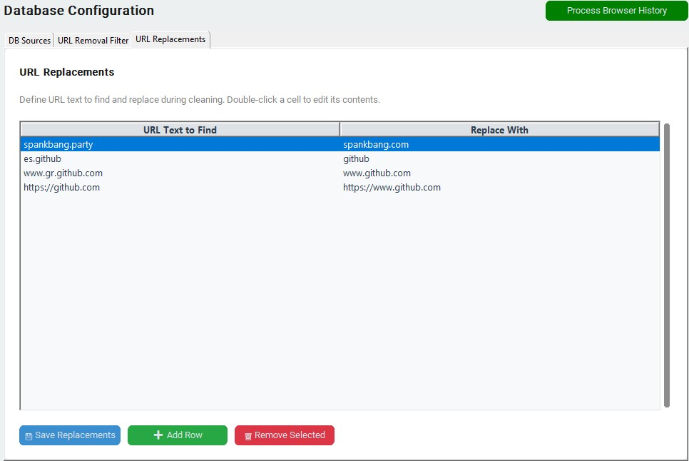

# Filter and Replace Guide

[Back to README](../README.md)

This page explains two useful options in plain terms:

- URL filter: remove unwanted links from consideration.
- URL replacement: correct common link text issues before matching.

> [!NOTE]
> Once URLs are saved to scenes, this app cannot change them. Changing the URL replacement does not affect scene matching, so if you make changes after a matched URL has already been saved, the app will continue adding more URLs to that scene. This is not a bad thing.

## URL Filter (Exclude Unwanted Links)

Use this when certain sites keep showing up but are not useful for your real matches.

Add one pattern per line. If a link contains that text anywhere, it gets ignored.

### Good examples

1. `localhost`  
   Ignores local links like `http://localhost:9999/...`

2. `google.com`  
   Ignores generic search-result links from Google.

### How to think about filter text

1. Add new entries only after you notice bad matches.
2. Keep entries specific.

### Common mistakes

1. Adding spaces by accident (` google.com`) which may not behave as expected.
2. Expecting advanced wildcard logic. This is plain text matching.

## URL Replacement (Fix Link Text)

Use this when links are close to correct, but include a repeatable issue you want to fix automatically.

Each rule has two parts:

1. Text to find
2. Text to replace it with

If the “find” text appears inside a link, it gets swapped with the replacement text.

### Good examples

1. Find: `spankbang.party`  
   Replace with: `spankbang.com`  
   Result: `https://spankbang.party/...` becomes `https://spankbang.com/...`, and is now recognized by the scraper

2. Find: `es.example.com`  
   Replace with: `example.com`  
   Result: Spanish URL prefix gets replaced with standard URL expected for a scraper

3. Find: `https://example.com`  
   Replace with: `https://www.example.com`  
   Result: Adds `www.` prefix which may be necessary for a scraper.

### Common mistakes

1. Expecting case-sensitive or advanced pattern behavior; treat it as plain text replacement.

## Recommended Workflow

1. Add one replacement rule at a time.
2. Re-run and check results.
3. Keep only the rules that clearly improve matches.

[Back to README](../README.md)

